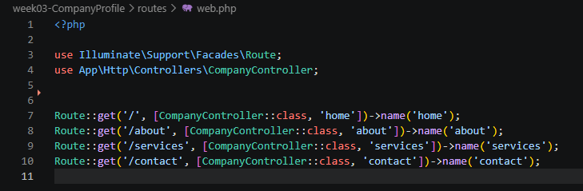
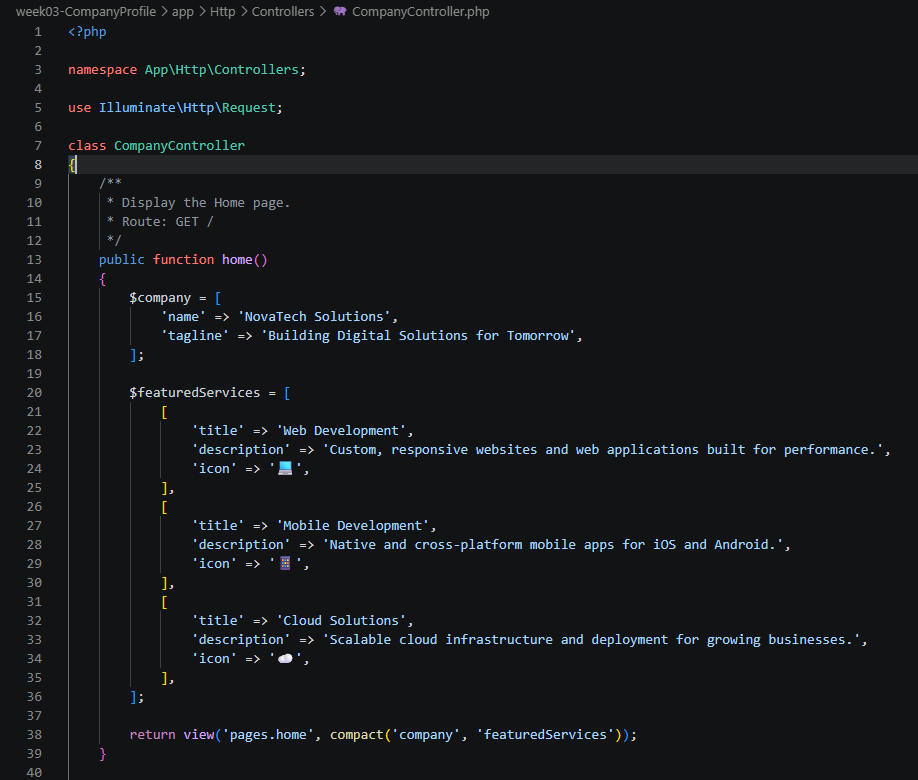
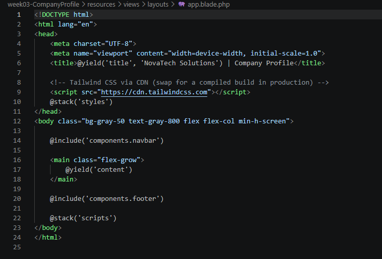

## Project Title
**Company Profile Website**

---

## Introduction

### What is a Company Profile Website?
A Company Profile Website is an official web application or digital platform that represents an organization online. It provides structured information regarding a company's mission, values, leadership, core services or products, client portfolio, and contact information.

### Why Businesses Need One
In the modern digital landscape, a website serves as a primary touchpoint for potential clients, partners, and job seekers. A dedicated web presence:
* Establishes digital credibility, trust, and brand presence.
* Provides 24/7 accessibility to information regarding services and solutions.
* Serves as an interactive hub for client inquiries, lead generation, and customer communication.
* Enhances marketing reach beyond geographic boundaries through web search visibility.

### Purpose of the Project
The primary purpose of this project is to construct a modern, responsive, and maintainable Company Profile Website using the Laravel web application framework. It serves to showcase best practices in modern PHP development, specifically leveraging Laravel's Model-View-Controller (MVC) architecture, Blade templating engine, clean routing, and controller-driven logic.

---

## Objectives
During the development of this project, the following technical and functional objectives were accomplished:
* Implemented clean MVC architecture in Laravel for proper separation of concerns.
* Created web routes in `routes/web.php` utilizing named routes and GET HTTP requests.
* Built a custom `CompanyController` to handle page routing logic and data presentation.
* Designed modular Blade view templates utilizing master layouts (`@extends`, `@section`, `@yield`) and reusable components (`@include`).
* Constructed key public pages: **Home**, **About**, **Services**, and **Contact**, along with dynamic site-wide navigation and footer components.
* Established an organized project file structure adhering to standard Laravel conventions.

---

## MVC Architecture

### What is MVC?
MVC stands for **Model-View-Controller**. It is a software architectural pattern that divides an application into three interconnected components:
* Model: Handles application data, business logic, and database operations.
* View: Manages the user interface (UI) and visual presentation layer.
* Controller: Acts as an intermediary, receiving HTTP requests from the browser, retrieving data via Models, and passing data to Views for rendering.

### Why Laravel Uses MVC
Laravel adopts the MVC pattern to encourage clean code architecture, maintainability, and scalability. By separating the routing and data handling from UI presentation:
* Developers can work on views (frontend) and controllers/models (backend) simultaneously.
* Application code becomes significantly easier to debug, refactor, and extend over time.

### Advantages of MVC in Software Development
* Separation of Concerns: UI design and backend logic are isolated from one another.
* Code Reusability: Views and layout templates can be reused across different routes.
* Ease of Maintenance: Modifying user interfaces does not impact business logic or database layers.
* Testability: Independent components can be systematically unit tested.

### Request Flow Diagram

Client (Browser)
│
▼
Route (web.php)
│
▼
CompanyController
│
▼
Blade View
│
▼
HTML Response
│
▼
Client (Browser)

---

## Laravel Routing

### What is Routing?
Routing in Laravel acts as the entry point for HTTP requests. It accepts request URLs from the browser and directs them to the appropriate handler—such as an inline closure or a specific method inside a Controller.

### Named Routes
Named routes allow developers to generate URLs or redirects conveniently by referring to a route's specific name rather than hardcoding URL paths throughout the application UI.

Route::get('/about', [CompanyController::class, 'about'])->name('about');

### get Requests
GET requests are HTTP requests used exclusively to retrieve data or display pages from a web server without altering system state. All static page navigation routes in this project utilize Route::get()

### Route Definitions (routes/web.php)

## Controllers
### Purpose of Controllers
Controllers group related HTTP request handling logic into a single class file. Instead of defining complex request processing directly inside routes/web.php, logic is offloaded to Controller methods.

### Benefits of Controllers
* Keeps routes/web.php concise and easy to read.

* Facilitates code reusability across multiple endpoints.

* Improves project organization by adhering to single-responsibility principles.

### Controller Methods
In CompanyController.php, separate methods are created to return views for each section of the website:

## Blade Templating Engine
### Blade Features & Directives
- Blade Layouts: Master templates that define the overall structure of an HTML page (e.g., <head>, main container, scripts).

- Blade Components: Reusable UI blocks such as headers, footers, or action buttons.

- @extends('layouts.app'): Specifies which master layout the child template inherits from.

- @section('content'): Defines a section of content to be injected into the master layout.

- @yield('content'): Placed in the layout to designate where child view content will be rendered.

- @include('components.navbar'): Embeds a sub-view or reusable component directly into another view.

## Laravel Folder Structure
- app/: Contains the core code of the application, including HTTP Controllers (app/Http/Controllers), Models, Middleware, and Providers.

- routes/: Contains all route definitions. Web routes accessed via browser live in routes/web.php.

- resources/: Houses views (resources/views), raw uncompiled assets (CSS/JS), and language localization files.

- public/: The web root directory containing index.php, entry files, and compiled assets (images, CSS, JS).

- bootstrap/: Handles framework initialization, application bootstrapping, and performance cache files (bootstrap/cache/).

- config/: Holds configuration files for database settings, mail, security, services, and core framework features.

## Problems Encountered
During the setup and development of this Laravel project, the following challenges were encountered:

- Target class [CompanyController] does not exist (Controller Namespace Issue)
When accessing routes, Laravel threw an HTTP 500 error stating that the controller class could not be resolved.

- InvalidArgumentException: View [pages.home] not found
Navigating to the home route generated a missing view exception despite creating the Blade file in VS Code.

- Blade Syntax & Rendering Error
Child pages failed to display content within the master layout structure, rendering blank main body areas or raw directives as plain text.

## Solutions
- Resolution for Controller Namespace Issue
Imported the full namespace of CompanyController at the top of routes/web.php using use App\Http\Controllers\CompanyController; and defined routes using class notation [CompanyController::class, 'method'].

- Resolution for View Not Found
Corrected file location and naming conventions. Ensured the Blade file was named home.blade.php (with the .blade.php extension) and placed inside the subfolder resources/views/pages/ rather than directly in resources/views/.

- Resolution for Blade Rendering Issues
Ensured that @yield('content') inside layouts/app.blade.php exactly matched the identifier used in @section('content') in child templates, and checked that directives were preceded by the @ symbol without typos.

## Reflection
Through building this Company Profile Website in Laravel, I gained a deep practical understanding of the Model-View-Controller (MVC) architectural pattern. MVC organizes software development by explicitly separating data management, business logic, and presentation interfaces. Learning this pattern highlighted how modern web applications structure code to achieve long-term maintainability, clarity, and scalability.

The concept of separation of concerns is fundamental to scalable web development. In traditional monolithic PHP scripts, database queries, HTML markup, and request handling were frequently mixed into single files. This approach inevitably resulted in fragile codebases that were difficult to debug or extend. MVC eliminates this issue by enforcing strict boundaries, routes capture HTTP requests, controllers direct request processing, and Blade views focus strictly on UI presentation. Because UI templates do not contain complex backend logic, frontend styles or layouts can be modified without risking breaking underlying business operations.

Understanding how routes, controllers, and views interact provided clarity on Laravel’s internal request lifecycle. When a user requests a URL, routes/web.php matches the request method and URI, delegating execution to a specific controller method. The controller then processes any incoming request parameters, coordinates with models or service layers if data processing is needed, and selects a designated Blade view. The Blade engine compiles layouts, components, and page directives into standard HTML, which the server returns as an HTTP response to the browser. This structured pipeline makes application flow transparent and straightforward to trace.

## References
Laravel Documentation (2024): Routing. Laravel. https://laravel.com/docs/routing

Laravel Documentation (2024): Controllers. Laravel. https://laravel.com/docs/controllers

Laravel Documentation (2024): Blade Templates. Laravel. https://laravel.com/docs/blade

MDN Web Docs. (2023). The MVC Architecture. Mozilla. https://developer.mozilla.org/en-US/docs/Glossary/MVC

PHP Documentation Group. (2024). PHP Manual: Classes and Objects. PHP.net. https://www.php.net/manual/en/language.oop5.php

Tailwind Labs. (2024). Tailwind CSS Documentation. Tailwind CSS. https://tailwindcss.com/docs